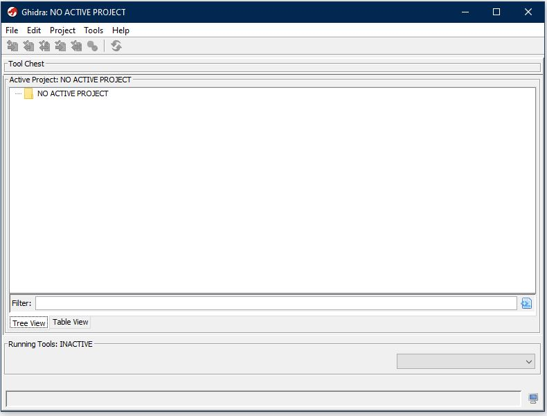
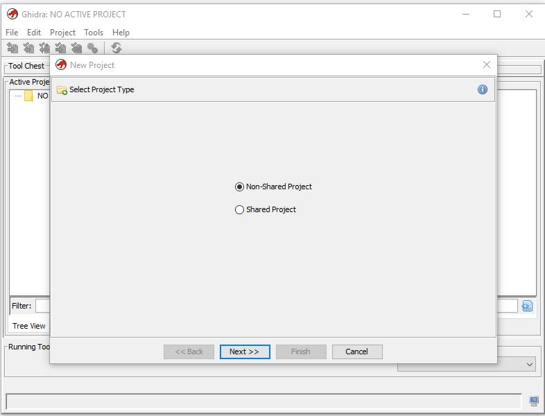
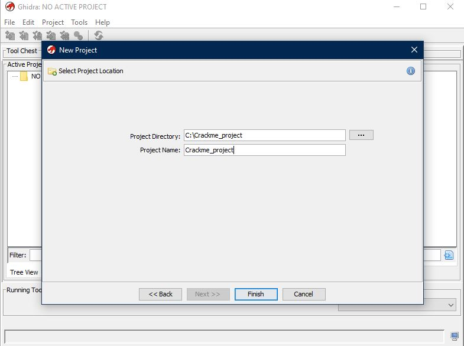
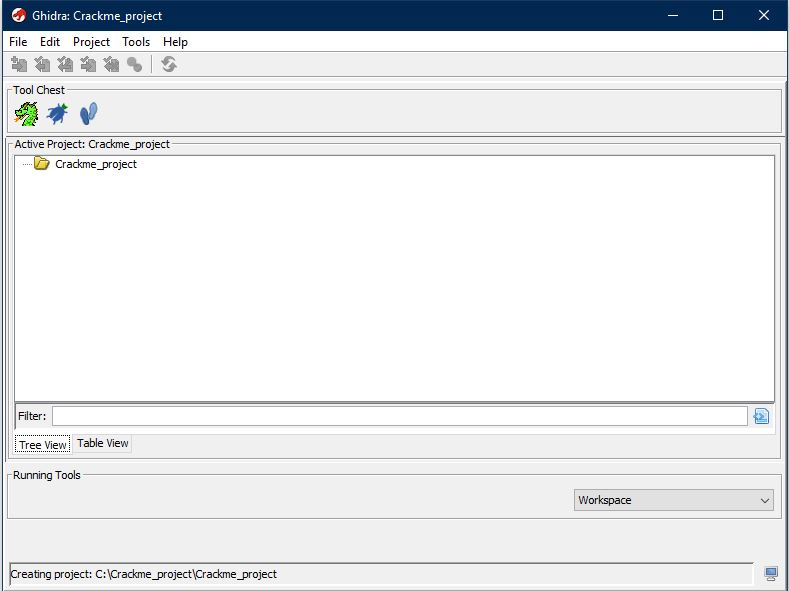

# How to import file and create a project in Ghidra

## How to create a project

To begin researching some executable or library in Ghidra you actually have to create project and import file to it.
1. Launch Ghidra, then press File --> New Project

2. You'll see this window, here click Non-Shared Project

3. Next, you'll have to decide where your project will be located. Name it too!

4. That's all. You now can add files to your project and start reversing.

## How to import file to a project
